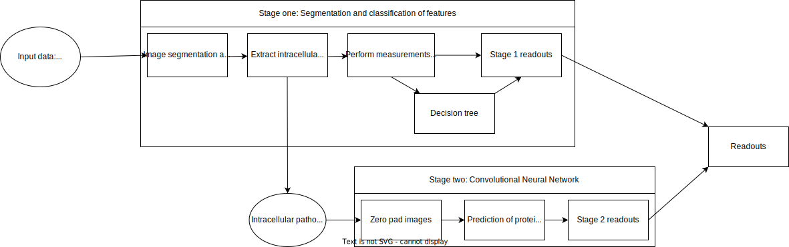

# Note: This project is still a work in progress.
# Analysing host pathogen interactions with an artificial intelligence pipeline

## Problem and introduction
There are currently few host-pathogen workflows that use deep learning to analyse protein recruitment. This pipeline will analyse high content images of cells, pathogens and nuclei to perform readouts about the replication of pathogens in host cells. In addition, a deep learning model will be used to analyse protein recruitment.

### Input data
Fluorescence image of pathogen, cells and nuclei from the same field of view.

### Pipeline


### Running the program
There is a [dataset](https://datadryad.org/stash/dataset/doi:10.5061/dryad.6vq2mp0) that I used to run this pipeline with, which contains the images of the cells, nuclei and pathogens, as well as the training data for a decision tree. In order to correctly run this pipeline, please run at the root directory of this repository: 
```
pip install -r requirements.txt
```
This will install all the required packages.
Another software that must be installed is [maven](https://maven.apache.org/).

To begin running the program, change to ./src, and then type into the terminal ```python GUIstart.py```, and follow the prompts.

### Retraining the decision tree
If the decision tree is to be trained/retrained, simply change into the ./src/stage_one directory, and run ```python decision_tree.py [training_file_name]```.
